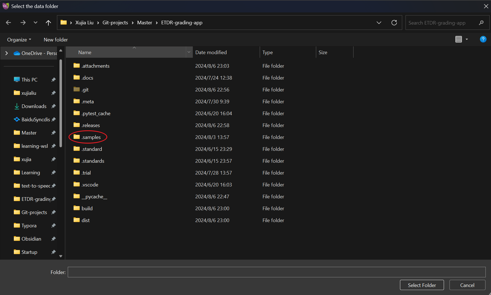

<h1 align="center">ETDR Grading App</h1>

## Documents

[Simplified Chinese](./README.zhs.md) | [Traditional Chinese](./README.zht.md) | [English](README.md)

## Introduction

This is an application for evaluating diabetic retinopathy ETDR grading, designed to help clinical ophthalmologists streamline the evaluation process. The project was proposed by [Carol YL CHEUNG](https://www.ovs.cuhk.edu.hk/en/about-us/our-teams/academic-team/carol-cheung/) and her team (special thanks to Danqi Fang and Dawei Yang for their valuable suggestions) and independently developed by myself, [Xujia Liu](https://github.com/xujialiu).

## Download

Please visit [this link](https://github.com/xujialiu/ETDR-grading-app/releases) to download and install the software.

## Instructions
### Logging in and Loading Data

For first-time users, you need to register a user account. First, log in as the root user; the username and password for the root user are both "root."

After logging in, click on User - Register in the top left menu bar to register a new user (the software will record the username as the grader in the database every time it is saved). For future use, simply log in with the registered username and password.

Select a folder. If you are unsure about the required folder format, please refer to this [samples.zip](https://github.com/xujialiu/ETDR-grading-app/releases/download/samples/samples.zip) dataset (needs to be unzipped).

### How to Evaluate

- Graded list: A list of evaluated patients.
- Database: Scores saved to the database can be viewed here.
- Patient ID / Visit Date: Patients with specific times and eyes removed from the `Graded list` in `select folder`.

Clicking on the patient's ID in the Graded list for the corresponding time and eye will take you to that time and eye for evaluation.

ETDR grading standards need to be compared with standard images. For specific scoring rules, please refer to the [original ETDR article](https://pubmed.ncbi.nlm.nih.gov/2062513/).

After the evaluation is completed, click the `save` button at the bottom right to save the evaluation data to the database. The app will automatically jump to the next corresponding time and eye for that patient.

### Exporting Results

Click on File - Export - (Graded list / Database / Patient ID / Visit Date) in the top left menu bar to export results as .csv or .excel files.

## Issues and Bug Reports

If you encounter any problems or need to report bugs, please visit the [Issues](https://github.com/xujialiu/ETDR-grading-app/issues) page of this repository to provide feedback, or contact me directly via email at [xujialiuphd@gmail.com](mailto:xujialiuphd@gmail.com).