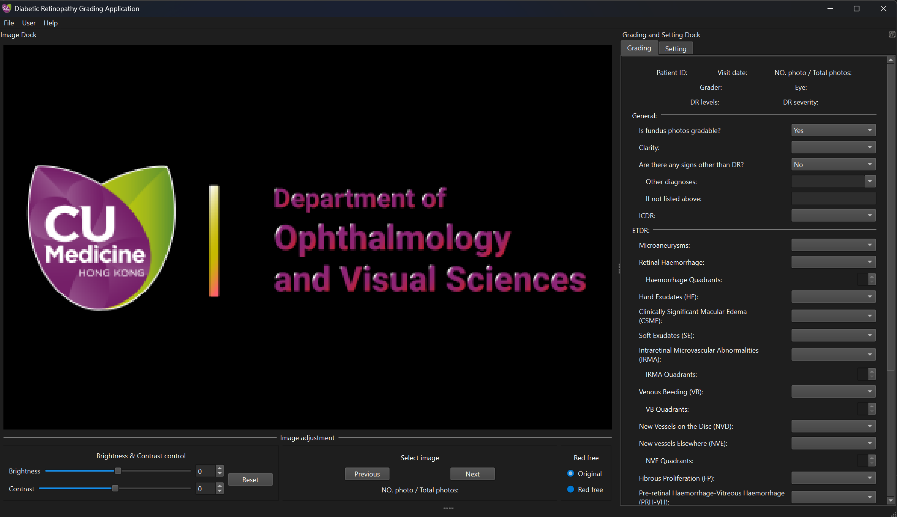
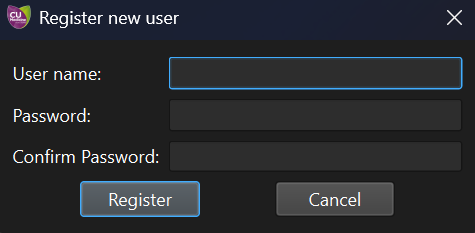
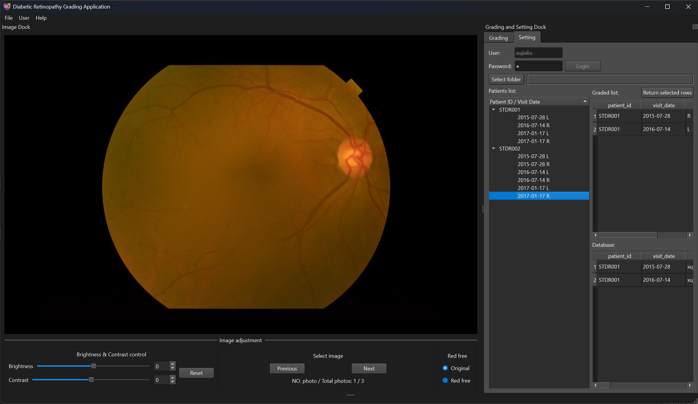

<h1 align="center">ETDR 评分应用</h1>

## 文档

[简体中文](./README.zhs.md) | [繁体中文](./README.zht.md) | [英语](README.md)

## 介绍

这是一个用于评估糖尿病视网膜病变 ETDR 评分的应用程序，旨在帮助临床眼科医生简化评估过程。该项目由 [Carol YL CHEUNG](https://www.ovs.cuhk.edu.hk/en/about-us/our-teams/academic-team/carol-cheung/) 及其团队提出（特别感谢 Danqi Fang 和 Dawei Yang 的宝贵建议），并由我本人 [Xujia Liu](https://github.com/xujialiu) 独立开发。

## 下载

请访问[此链接](https://github.com/xujialiu/ETDR-grading-app/releases)下载并安装软件。

## 使用说明
### 登录和加载数据

首次使用时，您需要注册一个用户帐户。首先，以 root 用户登录；root 用户名和密码都是 "root"。

登录后，点击左上方菜单栏中的 User - Register，注册一个新用户（每次保存时，软件会将用户名记录为数据库中的评分者）。以后的使用中，只需使用注册的用户名和密码登录即可。

选择一个文件夹。如果您不确定所需文件夹格式，请参考此 [samples.zip](https://github.com/xujialiu/ETDR-grading-app/releases/download/samples/samples.zip) 数据集（需要解压）。

### 如何评估

- Graded list：已评估患者的列表。
- Database：可以在此查看保存到数据库的评分。
- Patient ID / Visit Date：在 `选择文件夹` 中删除特定时间和眼睛的 `评分列表` 中的患者。

点击Graded list中的患者ID对应的时间和眼别，可以跳转到该时间和眼别进行评估。

ETDR 评分标准需要与标准图像进行比较。具体评分规则请参阅 [原始 ETDR 文章](https://pubmed.ncbi.nlm.nih.gov/2062513/)。

评估完成后，点击右下角的 `保存` 按钮将评估数据保存到数据库中。应用程序将自动跳转到该患者的下一个对应时间和眼睛。

### 结果导出:

点击左上角菜单栏，File - Export - (Graded list / Database/Patient ID / Visit Date) 可将结果导出为.csv或.excel格式。

## 问题和错误报告

如果您遇到任何问题或需要报告错误，请访问此存储库的 [Issues](https://github.com/xujialiu/ETDR-grading-app/issues) 页面提供反馈，或直接通过电子邮件 [xujialiuphd@gmail.com](mailto:xujialiuphd@gmail.com) 联系我。