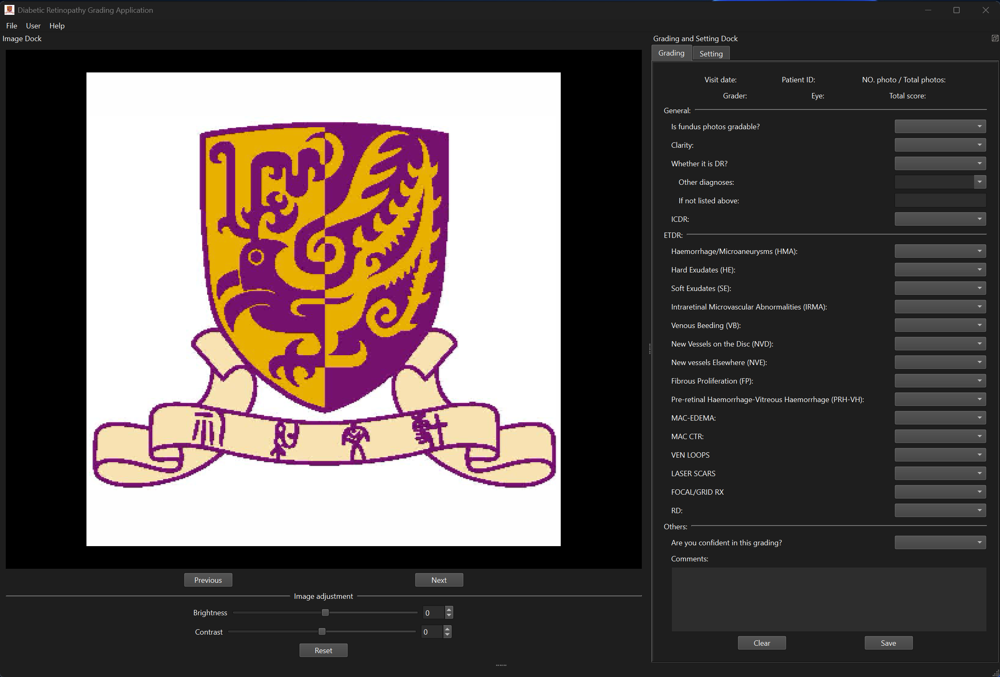
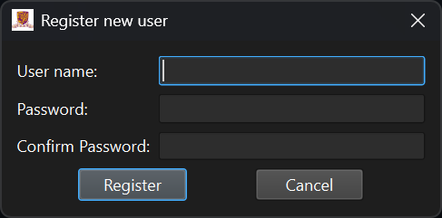
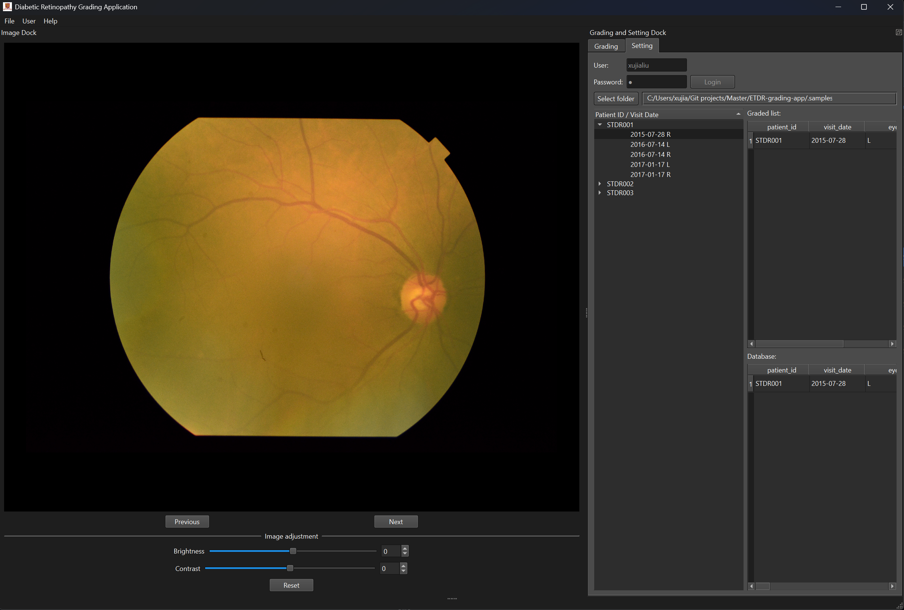

<h1 align="center">ETDR 評分應用</h1>

## 文件

[簡體中文](./README.zhs.md) | [繁體中文](./README.zht.md) | [英語](README.md)

## 介紹

這是一個用於評估糖尿病視網膜病變 ETDR 評分的應用程序，旨在幫助臨床眼科醫生簡化評估過程。該項目由 [Carol YL CHEUNG](https://www.ovs.cuhk.edu.hk/en/about-us/our-teams/academic-team/carol-cheung/) 及其團隊提出（特別感謝 Danqi Fang 和 Dawei Yang 的寶貴建議），並由我本人 [Xujia Liu](https://github.com/xujialiu) 獨立開發。

## 下載

請訪問[此連結](https://github.com/xujialiu/ETDR-grading-app/releases)下載並安裝軟件。

## 使用說明
### 登錄和加載數據

首次使用時，您需要註冊一個用戶賬戶。首先，以 root 用戶登錄；root 用戶名和密碼都是 "root"。

登錄後，點擊左上方菜單欄中的 User - Register，註冊一個新用戶（每次保存時，軟件會將用戶名記錄為數據庫中的評分者）。以後的使用中，只需使用註冊的用戶名和密碼登錄即可。

選擇一個文件夾。如果您不確定所需文件夾格式，請參考此 [samples.zip](https://github.com/xujialiu/ETDR-grading-app/releases/download/samples/samples.zip) 數據集（需要解壓）。

### 如何評估

- Graded list：已評估患者的列表。
- Database：可以在此查看保存到數據庫的評分。
- Patient ID / Visit Date：在 `選擇文件夾` 中刪除特定時間和眼睛的 `評分列表` 中的患者。

點擊Graded list中的患者ID對應的時間和眼別，可以跳轉到該時間和眼別進行評估。

ETDR 評分標準需要與標準圖像進行比較。具體評分規則請參閱 [原始 ETDR 文章](https://pubmed.ncbi.nlm.nih.gov/2062513/)。

評估完成後，點擊右下角的 `保存` 按鈕將評估數據保存到數據庫中。應用程序將自動跳轉到該患者的下一個對應時間和眼睛。

### 結果導出:

點擊左上角菜單欄，File - Export - (Graded list / Database/Patient ID / Visit Date) 可將結果導出為.csv或.excel格式。

## 問題和錯誤報告

如果您遇到任何問題或需要報告錯誤，請訪問此存儲庫的 [Issues](https://github.com/xujialiu/ETDR-grading-app/issues) 頁面提供反饋，或直接通過電子郵件 [xujialiuphd@gmail.com](mailto:xujialiuphd@gmail.com) 聯繫我。